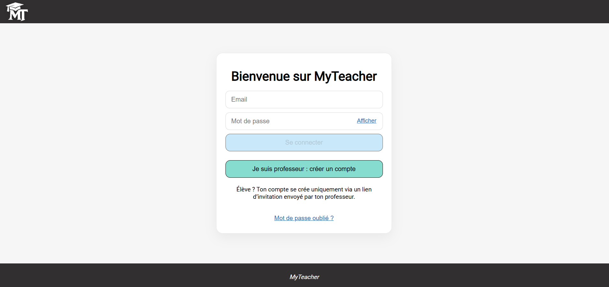

# MyTeacher — Backend API

## Summary
- **Project type**: Backend API for web application - SaaS type
- **Status**: MVP
- **Built with**: Node.js, Express, MongoDB, Mongoose
- **Purpose**: Backend API for a web application designed to help independent teachers to manage their daily business.

## Overview
This repository contains the backend of **MyTeacher**.  
This project is an end of training bootcamp project, developed during two weeks by a team of 4 developers.  
This API is responsible for authentication, database interactions, file uploads, email sending, real-time chat service and invoice pdf generation.

## Main Features
- User authentication using JWT stored in cookie and password hashing
- Protected routes using authentication middleware
- Role-based access control implemented through middleware
- Provides endpoints for the frontend to support frontend features
- Email sending
- File upload using cloudinary
- Real-time chat
- Invoice pdf generation

## Tech Stack
- Node.js
- Express
- MongoDB
- Mongoose
- JWT
- bcrypt
- Other services : Cloudinary, Resend, Pusher.

## Prerequisites
Before running the project locally, make sure the frontend is installed and configured.  
See frontend repository : https://github.com/Thomas-Thomas-2/myteacher-frontend.git  
Also make sure to have a MongoDB database configured and connected to the backend.  
A cloudinary account and a resend API key are necessary.

## Installation
Clone the repository and install dependencies:  
git clone https://github.com/Thomas-Thomas-2/myteacher-backend.git  
cd myteacher-backend  
npm install  
npm run start

## Environment variables
Create a .env file at the root of the project.  
For local launch, set these with your own values:  
CONNECTION_STRING=mongodb+srv://...  
JWT_SECRET=your_secret  
FRONT_URL=http://localhost:3001  
RESEND_API_KEY=your_key  
CLOUDINARY_URL=your_url

## Deployment
This backend is deployed on Render : https://api.my-teacher-app.fr/

## Demo
Watch the demonstration :  

